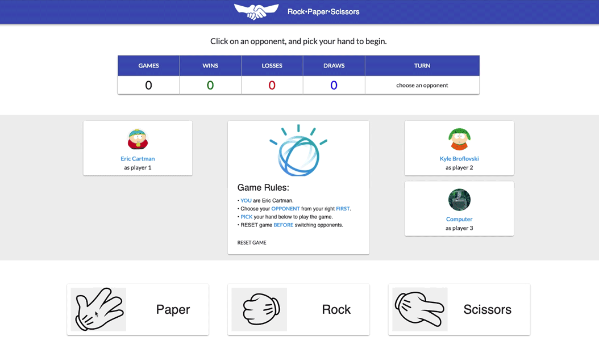

### Rock-Paper-Scissors game with React
- Play against computer or against another person.

### To install
- open your local machine terminal and type:
  `git clone https://github.com/stefan22/rockpaper.git`
- type: `cd rockpaper`
- type: `npm install` (to install dependencies)
- type: `npm start` (to run local server in development mode)
- open http://localhost:3000 to view it in the browser.

#### Game Rules
- You are Eric Cartman
- Choose your Opponent from your right First.
- Pick your hand from bottom set of options to start playing. That's it.
- Reset game Before switching oponents.

> desktop only.

##### Warning: first-time video editing below

<kbd>RPS in-action</kbd> 
 

 

(..†he•En∂.)
